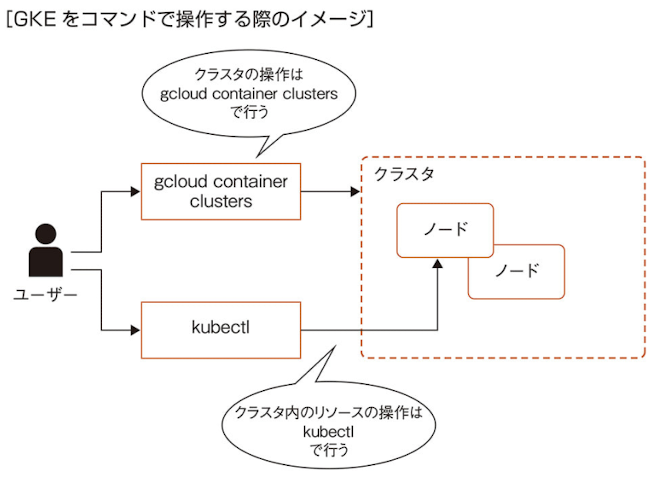

# gcloud CLI

## gcloud config configurations

gcloud CLI の設定を管理するコマンド

```
設定 A

- project = my-projectA
- account = xxx@example.com

設定 B

- project = my-projectB
- account = yyy@example.com
```

```
# 表示
gcloud config configurations list

# 作成
gcloud config configurations create my-config

# 有効化
gcloud config configurations activate my-config
```

## gcloud config set

gcloud CLI の設定を変更するためのコマンド

```
# 現在のデフォルトのリージョンを変更
gcloud config set compute/region us-central1

# 現在のデフォルトのゾーン設定を変更
gcloud config set conpute/zone us-central1-a
```

## gcloud compute instances create

Conpute Engine インスタンスを作成するためのコマンド

```
gcloud compute instance create my-instance --machine-type=n1-standard-2 --zone=us-central1-a
```

## gcloud compute ssh

Compute Engine インスタンスに SSH で接続するコマンド

```
gcloud compute ssh INSTANCE_NAME
```

## gcloud compute netwroks create

VPC ネットワークを作成するコマンド

```
gcloud compute networks create my-network --subnet-mode=custom
```

- subnet-mode: custome だと手動、auto だと自動

## gcloud compute networks subnets create

VPC ネットワーク内にサブネットを作成するコマンド

```
gcloud compute networks subnets create SUBNET_NAME --network=NETWORK_NAME --range=IP_RANGE
```

- IP_RANGE: サブネットに割り当てる IP アドレスの範囲を指定する。192.168.0.0/24

## gcloud compute networks subnets expand-ip-range

サブネットの IP アドレス範囲を変更するためのコマンド

```
gcloud compute networks subnets expand-ip-range SUBNET_NAME my-subnet --prefix-length=23
```

- PREFIX_LENGTH: サブネットのプレフィックス長を指定する

## gcloud container clusters

GKE のクラスタを操作するためのコマンド

```
gcloud container clusters create my-cluster --zone=us-centrail1-a
gcloud container clusters describe my-cluster --zone=us-centrail1-a
```

## gcloud app deploy

App Engine にデプロイするのコマンド

```
gcloud app deploy app.yaml --no-promote
```

`--no-promote`でアプリケーションが展開された後、自動的にトラフィックが新しいバージョンに向けられなくなる

```
gcloud app services set-traffic [SERVICE] --splits=v1=80,v2=20
```

# gsutil

Cloud Strage を操作するコマンドラインツール

## gsutil mb

新しくバケットを作成する

## gsutil cp

ファイルやフォルダをバケットにコピーしたり、
バケットのオブジェクトをローカルにコピーする

## gsutil ls

バケットに保存しているオブジェクトを一覧表示する

## gsutil mv

バケットに保存しているオブジェクトの場所を移動、あるいはオブジェクトの名前を変更するバケット

# kubectl

Kubernetes クラスタのコントロールプレーンと通信するためのコマンドラインツール



## kubectl get

指定したリソースの基本的な情報を確認する

```
kubectl get pods my-pod
kubectl get nodes my-node
```

## kubectl describe

指定したリソースの詳細な情報を確認する

```
kubectl describe pods my-pod
kubectl describe nodes my-node
```

# kubectl exec

コンテナ内で指定のコマンドを実行する

```
kubectl exec my-pod -- ls /etc
kubectl exec -it my-pod -- /bin/bash
```

## kubectl apply

Kubernetes リソースを定義するマニフェストを通じてアプリケーションを管理する

```
kubectl apply -f deployment.yaml
```

## kubectl scale

Kubernetes のリソースのレプリカ数を変更する

```
kubectl scale --replicas=3 deployment/myapp
```

## kubectl expose

Kubernetes クラスタ内の Deployment を指定し、Service として公開するためのコマンド

```
kubectl expose deployment my-deployment --type=LoadBalancer --port=80 --target-port=8080
```

# bq

BigQuery を操作するコマンドラインツール

## bg query

```
bg query --use_legacy_sql=false 'SELECT COUNT(*) FROM `myproject.mydataset.mystable`'
```

`--dry_run` オプションを指定すると実際のクエリを実行することなく、クエリのデータ量を計測することができる

## bg extract

BigQuery からテーブルのデータを Cloud Storage にエクスポートする

```
bg extract --compression=GZIP mydataset.mystable gs://mybucket/myfile.csv
```
